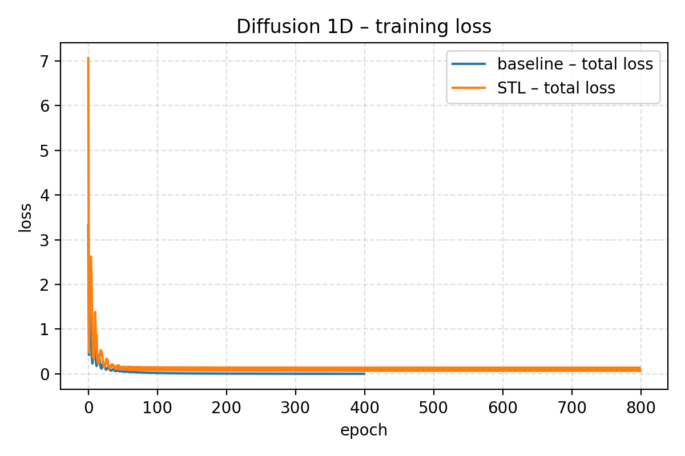
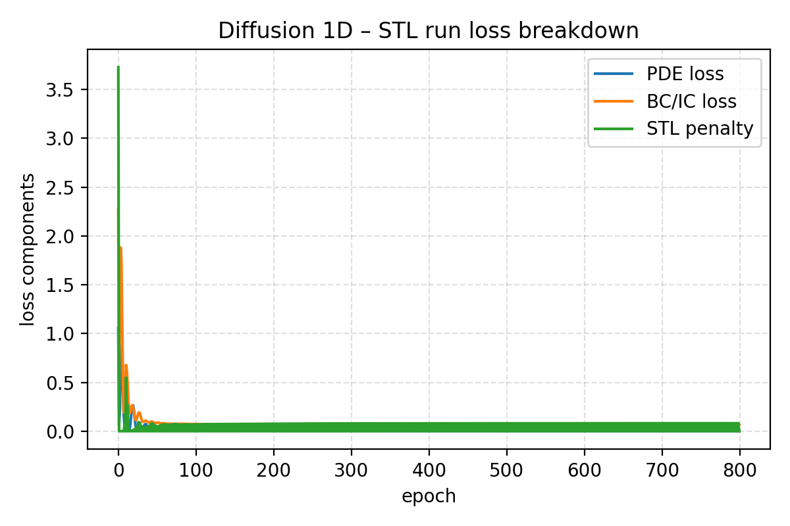
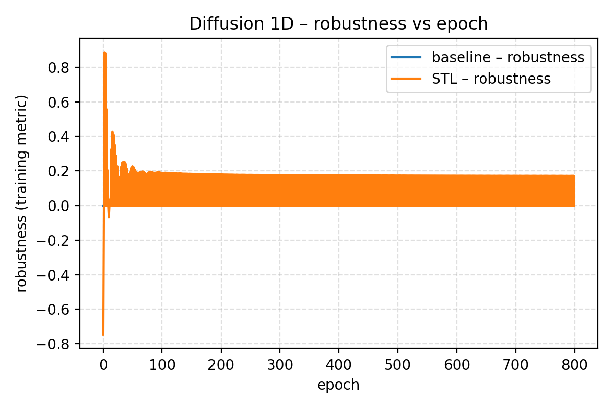

# physical-ai-stl

**Physical AI × Formal Specifications.** A minimal, CPU‑friendly, and reproducible sandbox for **monitoring** and **softly enforcing**:

- **Signal Temporal Logic (STL)** on time‑series / trajectories, and
- **Spatio‑temporal logics** (e.g., **STREL** via MoonLight; object‑centric specs via SpaTiaL)

…on physics‑based ML models (PINNs, neural ODE/PDE surrogates, and constrained learning/control).

> **Course context.** Built for Vanderbilt **CS‑3860‑01 Undergraduate Research (Fall 2025)** with Prof. Taylor T. Johnson.  
> Goal: prototype STL/STREL monitoring and (optional) differentiable penalties; compare a few “physical AI” stacks; run several concrete demos; and produce a concise report.

---

## Status at a glance (what is actually run + where the artifacts are)

| Item | Status | Where to look |
|---|---:|---|
| 1D diffusion PINN (baseline vs STL‑regularized) | ✅ executed | `assets/diffusion1d_*.png`, `results/diffusion1d_*_rtamt.json` |
| λ ablation on diffusion (tradeoff curves) | ✅ executed | `assets/diffusion1d_robust_vs_lambda.png`, `figs/diffusion1d_ablations.png` |
| Differentiable STL surrogate (`stl_soft.py`) | ✅ implemented + tested | `src/physical_ai_stl/monitoring/stl_soft.py`, `tests/test_stl_soft.py` |
| RTAMT wrapper + fallback evaluator | ✅ implemented + tested | `src/physical_ai_stl/monitoring/rtamt_monitor.py`, `scripts/eval_diffusion_rtamt.py` |
| 2D heat rollout (for spatial logic demos) | ✅ generated + committed | `assets/heat2d_scalar/field_xy_t.npy`, `assets/heat2d_scalar/meta.json` |
| STREL specs + MoonLight evaluator script | ✅ implemented | `scripts/specs/*.mls`, `scripts/eval_heat2d_moonlight.py` |
| Neuromancer / PhysicsNeMo / TorchPhysics hooks | ✅ stubs + “hello” demos | `src/physical_ai_stl/frameworks/` |

> **Important:** the repo is designed so optional heavy dependencies (RTAMT, MoonLight/Java, Neuromancer, PhysicsNeMo, TorchPhysics) are **optional**. Tests will **skip** gracefully if they are missing.

---

## What to look at first (for a fast demo)

**If you only have 5–10 minutes**, reproduce the diffusion case study and open the plots:

```bash
# 0) Create & activate venv (Windows: .venv\Scripts\activate)
python -m venv .venv && source .venv/bin/activate
python -m pip install -r requirements.txt -r requirements-dev.txt

# 1) Smoke tests (safe: will skip optional heavy deps)
pytest -q -k "hello or stl_soft or pde_example"

# 2) Diffusion case study + plots + monitoring outputs
make diffusion1d
make rtamt-eval
```

Then open:
- **Figures**: `assets/diffusion1d_*.png`, `figs/diffusion1d_ablations.png`
- **Monitor outputs**: `results/diffusion1d_baseline_rtamt.json`, `results/diffusion1d_stl_rtamt.json`

No `make` on your system? Run scripts directly (see **[docs/REPRODUCIBILITY.md](docs/REPRODUCIBILITY.md)**).

---

## Repository map (the only directories you usually need)

```text
src/physical_ai_stl/
  experiments/          toy PDE/ODE examples (diffusion1d, heat2d, ...)
  monitoring/           RTAMT + MoonLight helpers, and differentiable STL (stl_soft)
  frameworks/           small “hello” integration points (Neuromancer / PhysicsNeMo / TorchPhysics)
scripts/                CLI entrypoints (train/eval/plot), specs (.mls), env probe
configs/                YAML configs for scripts/run_experiment.py and friends
assets/, figs/           committed plots/figures used in the report/slides
results/                saved tensors/metrics + JSON monitoring outputs
```

---

## High-level architecture

### Block diagram: how everything connects (frameworks ⇄ physics ⇄ logic)

```mermaid
flowchart TB
  %% --- Inputs ---
  In1[PDE/ODE model<br/>IC/BC, parameters, grids] --> Core
  In2[Optional data<br/>(measurements, rollouts)] --> Core
  In3[Formal spec<br/>STL / STREL / SpaTiaL] --> Mon

  %% --- Physics-ML stacks (optional) ---
  subgraph Frameworks[Optional "physical AI" frameworks]
    NM[Neuromancer<br/>(SciML + constrained optimization)]
    PN[PhysicsNeMo<br/>(ex‑Modulus; operators + PINNs)]
    TP[TorchPhysics<br/>(PINNs/DeepONet/FNO)]
  end

  %% --- Repo core ---
  subgraph Core[physical-ai-stl core (this repo)]
    Model[Neural surrogate / PINN<br/>u_θ(x,t) or y_θ(t)]
    Train[Training loop<br/>PDE loss + data loss]
    Sim[Generate signals<br/>trajectories / fields]
  end

  %% --- Monitoring & training with specs ---
  subgraph Mon[Spec monitoring / soft enforcement]
    RT[RTAMT<br/>STL monitoring]
    ML[MoonLight<br/>STREL monitoring]
    SP[SpaTiaL<br/>object-centric specs]
    Soft[stl_soft.py<br/>differentiable STL surrogate]
  end

  Frameworks --> Model
  Model --> Sim --> RT
  Sim --> ML
  Sim --> SP

  %% Differentiable path for training-time constraints
  Soft -->|robustness ρ_soft| Train
  In3 --> Soft
  Train --> Model
```

**One sentence summary:** the repo produces **signals** (time series or spatio‑temporal fields) from a physics‑ML model, then **monitors** specs (RTAMT/MoonLight/SpaTiaL), and optionally feeds a **differentiable robustness penalty** back into training.

---

## Case study A: 1D diffusion PINN + STL regularization (executed + plots)

This is the most end‑to‑end example: **train → monitor → plot → compare baseline vs STL‑regularized**.

### Physical model

We treat the learned field as a “temperature”:

- Domain: \(x \in [0,1]\), \(t \in [0,1]\)
- PDE (toy): \(u_t = \alpha u_{xx}\)

The PINN learns \(u_\theta(x,t)\) by minimizing:
- PDE residual loss (physics)
- boundary/initial condition loss (constraints)
- optional **STL penalty** (soft spec enforcement)

### Specifications (written out)

To make “safety over the whole rod” compatible with temporal STL monitors, we reduce the field across space:

\[
s(t) \;:=\; \max_{x \in [0,1]} u(x,t)
\]

Then we monitor STL over the scalar time series \(s(t)\).

**Safety bound (always):**

\[
\varphi_{\text{safe}} := \mathbf{G}_{[0,1]}\big(s(t) \le U_{\max}\big)
\quad\text{(equivalently: }\forall t\in[0,1],\; \max_x u(x,t)\le U_{\max}\text{)}
\]

**Cooling / convergence (eventually):** (example of Prof. Johnson’s suggested “eventually” pattern)

\[
\varphi_{\text{cool}} := \mathbf{F}_{[0.5,1]}\big(s(t) \le U_{\text{cool}}\big)
\quad\text{(there exists }t\in[0.5,1]\text{ such that }\max_x u(x,t) \le U_{\text{cool}}\text{)}
\]

> **Where does “which points?” show up?**  
> The “\(\max_x\)” is approximated on a grid of spatial samples. “∀x” becomes “∀ sampled xᵢ”, with aggregation:
> - **training-time**: soft aggregation (e.g., softmax) on a coarser grid (`stl.n_x`, `stl.n_t`) for speed
> - **evaluation-time**: hard aggregation (max) on the full plotting grid (`n_x`, `n_t`)

### What is the output?

**Inputs:** (i) PDE + IC/BC, (ii) network architecture, (iii) STL spec(s), (iv) weights/hyperparameters  
**Output:** a trained PINN \(u_\theta\), plus artifacts: predicted fields, logs, plots, and monitor robustness.

### What is λ?

In configs and code, **λ = `stl.weight`** (a.k.a. `stl_weight` in some scripts). It scales the STL penalty inside the total loss:

\[
\mathcal{L}_{\text{total}} = \mathcal{L}_{\text{PDE}} + \mathcal{L}_{\text{BC/IC}} + \lambda\,\mathcal{L}_{\text{STL}}
\]

where \(\mathcal{L}_{\text{STL}}\) is built from a differentiable proxy robustness \(\rho_{\text{soft}}\) (see `src/physical_ai_stl/monitoring/stl_soft.py`). Intuition: **λ ↑ ⇒ stronger pressure to satisfy the spec**, at the cost of potentially worse fit to the PDE/data.

### Dataflow diagram (diffusion1d)

```mermaid
flowchart LR
  C[diffusion1d_*.yaml] --> Run[train_diffusion_stl.py]
  Run --> Samp[Collocation sampler<br/>(Sobol/grid)]
  Samp --> Net[PINN u_θ(x,t)]
  Net --> PDE[PDE residual loss]
  Net --> BCIC[BC/IC loss]
  Net --> Field[Predicted field u(xᵢ,tⱼ)]
  Field --> Reduce[Reduce over x<br/>s(t)=max_x u]
  Reduce --> RT[RTAMT-style STL monitor]
  Field --> Soft[stl_soft robustness<br/>ρ_soft(φ,u)]
  Soft -->|L_STL = ReLU(-ρ_soft)| Total[Total loss]
  PDE --> Total
  BCIC --> Total
  Total --> Opt[Optimizer]
  Opt --> Net
  RT --> Out[pass/fail + robustness]
  Out --> Plots[plots in assets/ + figs/]
```

### Results (committed artifacts + monitor outputs)

#### Fields (baseline vs STL-regularized)

| Baseline PINN | STL-regularized PINN |
|---|---|
|  |  |

#### Training curves







#### Quantitative monitoring summary (examples)

These robustness values are computed from the saved fields and written to:
- `results/diffusion1d_baseline_rtamt.json`
- `results/diffusion1d_stl_rtamt.json`

> Note: `scripts/eval_diffusion_rtamt.py` will use **RTAMT** if it is installed; otherwise it uses a small, spec‑limited **fallback** evaluator (sufficient for the patterns used here).
> The committed JSON files record which backend was used (`"backend"`).


```text
Safety spec:  φ_safe = G[0,1] ( max_x u(x,t) <= 1.0 )

baseline: robustness = -0.0040  (violated)
stl-run:  robustness =  0.3438  (satisfied)
```

Example “eventually” cooling spec (computed on the same saved fields):

```text
Cooling spec: φ_cool = F[0.5,1] ( max_x u(x,t) <= 0.3 )

baseline: robustness = -0.0750  (violated)
stl-run:  robustness =  0.0497  (satisfied)
```

#### λ tradeoff (ablation)


---

## Case study B: spatial logic demo (STREL on a 2D heat field)

STL is fundamentally temporal. For PDEs with **spatial** domains (2D/3D), it is often more natural to use **spatial operators** rather than collapsing everything to a single scalar time‑series.

This repo includes:
- a small **2D heat/diffusion** rollout: `assets/heat2d_scalar/field_xy_t.npy` + `assets/heat2d_scalar/meta.json`
- a MoonLight STREL spec: `scripts/specs/contain_hotspot.mls`
- a CLI evaluator: `scripts/eval_heat2d_moonlight.py`

### Included STREL spec (MoonLight syntax)

In `scripts/specs/contain_hotspot.mls`:

```text
contain_hotspot = eventually( globally( !(somewhere[0,100](hot)) ) )
```

Interpretation over a finite trace:
- “somewhere[0,100](hot)” ≈ “hot holds at **some** spatial location (within the whole grid)”
- “!(somewhere …)” ≈ “**nowhere** is hot”
- “globally( … )” ≈ “from now until end of trace”
- “eventually( globally( … ) )” ≈ “there exists a time after which the hotspot is gone for the rest of the trace”

### How `hot` is obtained from a PDE field

MoonLight monitors boolean‑valued signals. `eval_heat2d_moonlight.py` supports **binarizing** a real field \(u(x,y,t)\) into `hot(x,y,t)` using either:
- a **z‑score threshold**: `threshold = mean + k·std` (default k = 0.5), or
- a **quantile threshold** (e.g. `--quantile 0.995`)

This matters: a low threshold may treat the “hotspot” as persistent (spec violated), while a high threshold treats it as a transient hotspot (spec satisfied).

### Reproduce (requires Java + MoonLight)

```bash
# Best-effort extras install (MoonLight uses Java)
python -m pip install -r requirements-extra.txt
make java-check

# Evaluate STREL monitor on the included field
python scripts/eval_heat2d_moonlight.py   --field assets/heat2d_scalar/field_xy_t.npy   --layout xy_t   --mls scripts/specs/contain_hotspot.mls   --formula contain_hotspot   --quantile 0.995   --out-json results/heat2d_contain_hotspot.json
```

### CPU-only “sanity check” (no MoonLight)

Because `somewhere[0,100]` spans the whole 32×32 grid, the spec above reduces to a simple check on the **max temperature over space**:

- With the script’s default z-score threshold (k=0.5), the implied threshold is
  `mean + 0.5·std ≈ 0.089390` and the field contains at least one “hot” cell at every time ⇒ **violated on this finite trace**.
- With quantile threshold `q=0.995`, the threshold is ≈ `0.725494` and the field’s max falls below it for the remainder of the trace starting at index `37` (time ≈ `1.85` given dt=0.05) ⇒ **satisfied on this finite trace**.

> This is a lightweight consistency check (boolean, finite-trace) to validate that the “contain hotspot” idea is meaningful on the included field. The full STREL robustness should be computed with MoonLight.

---

## Framework hooks (Neuromancer / PhysicsNeMo / TorchPhysics)

The overall workflow is intentionally **framework-agnostic**:
1. produce a signal (trajectory or field),
2. monitor specs (RTAMT / MoonLight / SpaTiaL),
3. optionally convert robustness into a differentiable penalty for training.

This repo includes small “hello” demos / stubs showing where spec hooks attach:
- **Neuromancer**: `src/physical_ai_stl/frameworks/neuromancer_stl_demo.py`
- **TorchPhysics**: `src/physical_ai_stl/frameworks/torchphysics_hello.py`
- **PhysicsNeMo**: `src/physical_ai_stl/frameworks/physicsnemo_hello.py`

For an install+integration comparison table, see:
- **[docs/framework_survey.md](docs/framework_survey.md)**

---

## Reproducibility & artifacts

- **Step-by-step**: **[docs/REPRODUCIBILITY.md](docs/REPRODUCIBILITY.md)** (recommended)
- Results live in `results/` and figures are copied to `assets/` and `figs/` by the Makefile targets.

Useful Makefile targets:
```bash
make diffusion1d        # baseline + STL-regularized diffusion + plots
make rtamt-eval         # STL monitoring (RTAMT if installed; otherwise a safe fallback)
make heat2d             # generate a toy 2D heat rollout (no STREL monitoring)
make moonlight-eval     # STREL evaluation (requires Java+MoonLight)
make neuromancer-sine   # Neuromancer demo (optional dependency)
make ablations          # diffusion1d λ sweep (produces figs/diffusion1d_ablations.png)
```

**Environment metadata for committed diffusion figures** is stored in:
- `results/diffusion1d--baseline--20251117-164754-066122/env.json`
- `results/diffusion1d--stl--20251117-170002-822925/env.json`

---

## Candidate problem spaces / datasets (STL-friendly)

For a curated list (with rationale and links), see:
- **[docs/dataset_recommendations.md](docs/dataset_recommendations.md)**

---

## Scope & caveats (important)

- **Monitoring ≠ verification.** The differentiable penalties here are **heuristics**; they encourage satisfaction on sampled traces/grids but do not provide formal guarantees.
- **Spatial quantification is discretized.** “∀x” is approximated by evaluating at sampled grid points and aggregating.
- **Optional dependencies are optional by design.** Tests skip if RTAMT/MoonLight/SpaTiaL/frameworks are missing.

---

## References & pointers

Core tooling / frameworks:
- Neuromancer (PNNL): https://github.com/pnnl/neuromancer
- NVIDIA PhysicsNeMo: https://github.com/NVIDIA/physicsnemo
- Bosch TorchPhysics: https://github.com/boschresearch/torchphysics
- RTAMT (STL monitoring): https://github.com/nickovic/rtamt
- MoonLight (STREL): https://github.com/MoonLightSuite/moonlight
- SpaTiaL (object-centric specs): https://github.com/KTH-RPL-Planiacs/SpaTiaL

Related spec-learning / differentiable STL:
- STLnet (NeurIPS 2020): https://proceedings.neurips.cc/paper/2020/hash/a7da6ba0505a41b98bd85907244c4c30-Abstract.html  
  Code: https://github.com/meiyima/STLnet
- STLCG (differentiable robustness): https://github.com/StanfordASL/stlcg
- STLCG++: https://uw-ctrl.github.io/stlcg/  (PyTorch repo: https://github.com/UW-CTRL/stlcg-plus-plus)

Potential venue (mentioned in lab email thread):
- NASA Formal Methods (NFM 2026 CFP): https://nfm2026.github.io/cfp/
