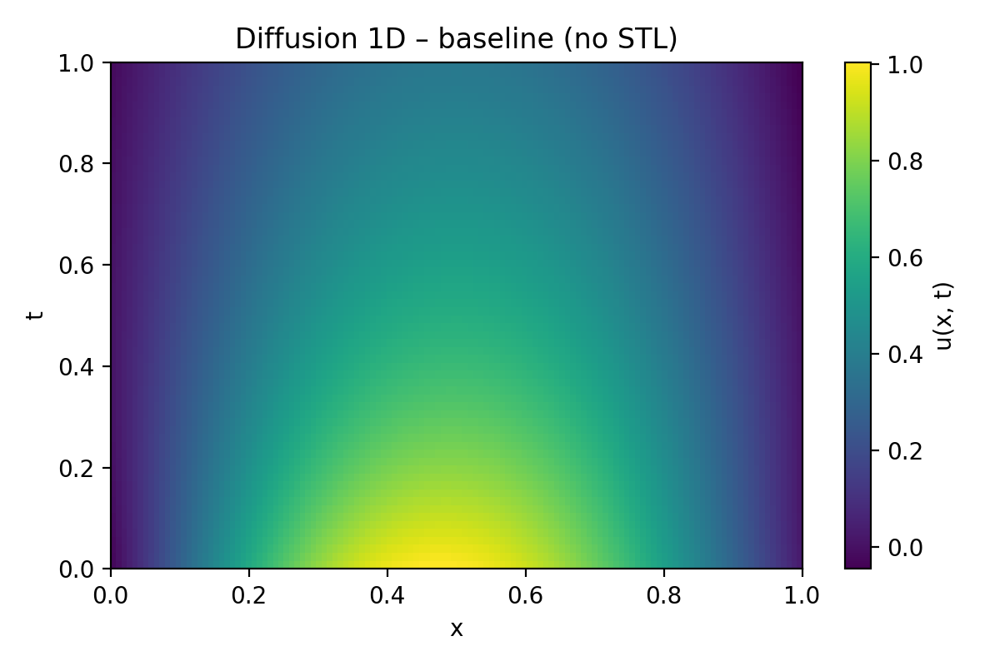
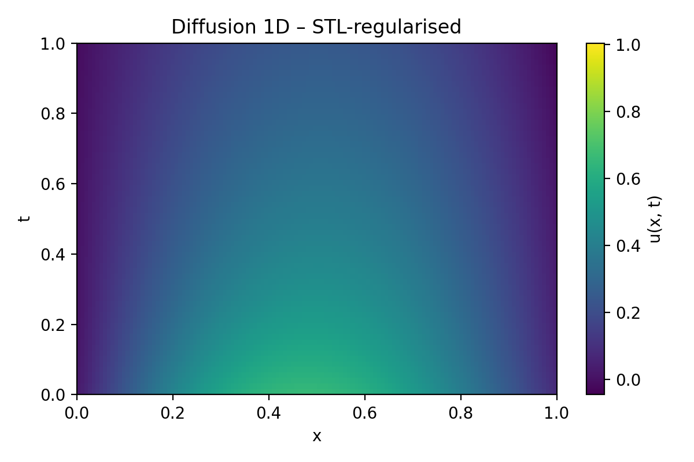
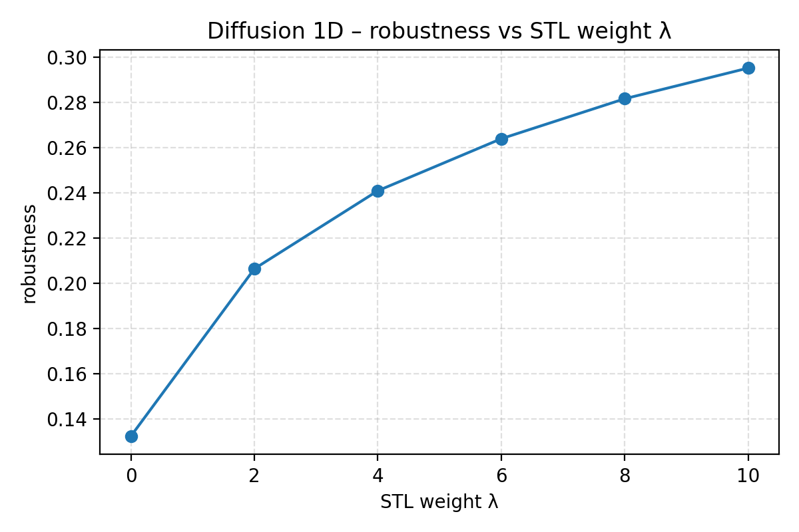

# Framework Survey — Physical AI + (Spatial) Signal Temporal Logic (STL)

> **Purpose.** Compare candidate physics‑ML frameworks and STL / spatial STL toolchains, then recommend a primary stack for CS‑3860‑01. The bar for this document is: someone who has not seen the repo should still be able to answer **(1) what connects to what**, **(2) what ran**, and **(3) what we should do next**.
>
> **Terminology.** “Physical AI” is increasingly used as an umbrella term for AI systems that operate in and reason about the physical world (often via physics‑based ML such as PINNs, neural ODE/PDE models, and neural operators). In this project, we use it in that pragmatic SciML sense. (One industry reference: https://www.nvidia.com/en-us/glossary/generative-physical-ai/ )

## TL;DR (recommendation)

**Primary physics‑ML framework (course deliverable): Neuromancer.**  
Best balance of: PyTorch‑native APIs, constrained optimization + differentiable programming, and easy hooks for STL penalties and monitoring.

**Secondary PDE framework (fast extra baselines): TorchPhysics.**  
Clean API for PINNs and quick PDE variants (Burgers, advection‑diffusion) with minimal install friction.

**Stretch / scale option: NVIDIA PhysicsNeMo.**  
Strong neural‑operator ecosystem and examples, but heavier and GPU‑leaning; adopt when scaling beyond toy problems.

**Monitoring stack:**  
- **RTAMT** for STL monitoring (offline/online bounded‑future).  
- **MoonLight** for STREL (spatio‑temporal reach / escape) monitoring on grids or graphs.  
- **SpaTiaL** optionally for object‑centric spatial relations (robotics‑style tasks).

---

## 0) Architecture diagrams (what connects to what)

### 0.1 High‑level block diagram (repo + external frameworks)

```mermaid
flowchart LR
  %% Inputs
  Data[(Problem spec: PDE, IC/BC, dataset, or simulator)]

  %% Backends (optional)
  subgraph Backends["Physics‑ML backends (optional)"]
    NM[Neuromancer]
    PN[PhysicsNeMo]
    TP[TorchPhysics]
    PT[Pure PyTorch PINN (this repo)]
  end

  %% Core
  subgraph Core["This repo: physical-ai-stl core"]
    Exp[Experiment runner + configs]
    Train[Training loops (PyTorch)]
    Soft[Soft STL surrogate (differentiable)]
    Adapt[Adapters: traces/fields → signals]
    Log[Logging + plots + artifacts]
  end

  %% Monitors
  subgraph Monitors["Monitoring (optional, for auditing + figures)"]
    RT[RTAMT (STL)]
    ML[MoonLight (STREL)]
    SP[SpaTiaL (object‑centric)]
  end

  Data --> Exp --> Train
  NM --> Train
  PN --> Train
  TP --> Train
  PT --> Train

  Train --> Adapt
  Adapt --> RT --> Log
  Adapt --> ML --> Log
  Adapt --> SP --> Log

  Soft --> Train
  Train --> Out[(Outputs: trained model, rollouts, robustness, figures)]
```

**Key idea:** training is always a PyTorch loop. Frameworks (Neuromancer / PhysicsNeMo / TorchPhysics) are *optional backends* that help build the physics model or PDE residual. Monitoring tools are used to generate **robustness values**, **violation localization**, and **paper‑grade plots**.

### 0.2 Detailed data flow (Diffusion1D example)

```mermaid
flowchart TD
  PDE[PDE + IC/BC] --> Samp[Sample collocation points (x,t)]
  Samp --> Net[PINN: u_theta(x,t)]
  Net --> LossTask[Loss_task: PDE residual + IC/BC]
  Net --> Trace[Audit grid: u(x_i,t_k)]
  Trace --> Agg[Space aggregation: max over x (or min robustness)]
  Spec[STL specs] --> Mon[Monitor → robustness ρ]
  Agg --> Mon

  Mon --> LossSTL[Loss_stl: penalty from ρ]
  LossTask --> Sum[Total loss = Loss_task + λ * Loss_stl]
  LossSTL --> Sum --> Opt[Optimizer step] --> Net

  Mon --> Plots[Figures: field plots, losses, robustness, ablations]
  LossTask --> Plots
```

**Inputs:** PDE, sampling strategy, network architecture, optimizer settings, and a set of STL specs.  
**Outputs:** a trained model plus audited rollouts with robustness curves and figures.

### 0.3 Detailed data flow (Heat2D + STREL auditing)

```mermaid
flowchart TD
  Field[2D field rollout u(x,y,t)] --> Pred[Predicate: hot(x,y,t) = (u > tau)]
  Pred --> Graph[Grid graph (4‑ or 8‑neighborhood)]
  Graph --> ML[MoonLight STREL monitor]
  Spec2[STREL formulas (contain / quench / deadline)] --> ML
  ML --> Rho[Robustness over time and space]
  Rho --> Viz[Heatmaps + violation localization + summary stats]
```

This is the minimal story for “spatial makes sense for PDE”: we evaluate properties at **many locations** and reason about **neighborhoods / regions**.

---

## 1) Physics‑ML frameworks (survey + integration plan)

| Framework | What it is (official) | Why it is useful here | Integration hook (in our project) | Friction / risk | License |
|---|---|---|---|---|---|
| **Neuromancer** (PNNL) | PyTorch differentiable programming for parametric constrained optimization, system ID, and differentiable control | Easiest end‑to‑end path for “physics + ML + constraints”; natural place to add STL penalties and constrained training | Add robustness penalty to its training objective; use its model components for ODE/PDE and control examples | Smaller “operator benchmark” ecosystem than NVIDIA; still actively developed | BSD‑3‑Clause |
| **NVIDIA PhysicsNeMo** | Physics‑AI framework (neural operators, PINNs, PDE tooling), tuned for NVIDIA stack | Best if/when we scale to operator learning and GPU training; lots of examples to borrow | Wrap its training loop with monitoring; audit rollouts; compare overhead and robustness | Heavier install; shines on GPUs; container often recommended | Apache‑2.0 |
| **Bosch TorchPhysics** | Mesh‑free PDE learning (PINNs, DeepRitz, DeepONet, FNO) | Fast way to add extra PDE case studies with minimal code | Use its PDE definitions and sampling; add our STL/STREL monitoring around predicted fields | Smaller community; fewer “end‑to‑end” tutorials than Neuromancer | MIT |

**Practical selection rule (course):** pick the framework that minimizes time to (a) a runnable example, (b) plots, (c) a clear monitoring story. That is why Neuromancer is “primary” and TorchPhysics is “secondary”.

---

## 2) STL / STREL toolchain (survey + what we use it for)

| Tool | What it does | Where we use it | Notes |
|---|---|---|---|
| **RTAMT** | STL monitoring (robustness) for discrete and dense time; offline and online bounded‑future | Auditing time‑series and scalar summaries of PDE fields (example: max_x u(x,t)) | Great for producing correctness plots and “falsified at time t*” evidence |
| **MoonLight** | STREL monitoring (spatio‑temporal reach / escape) on graphs and grids | Auditing 2D PDE fields on a grid graph; computing spatio‑temporal robustness and localization | Needs Java (course plan assumes Java 21+ is acceptable) |
| **SpaTiaL** | Object‑centric spatio‑temporal logic for robotics / planning tasks | Optional: if we add a robotics‑style case study (agents + obstacles) | Useful, but not required for PDE‑first narrative |

**Important implementation note (for clarity):**
- We can always **audit** with RTAMT/MoonLight (no gradients required).  
- For **training**, we prefer a **differentiable surrogate** (this repo’s “soft STL” implementation) and then cross‑check with RTAMT/MoonLight for correctness figures.

---

## 3) How STL/STREL enters training (and what λ means)

### 3.1 Two modes: audit‑only vs training‑time penalty

**Mode A — Audit only (always supported):**
1) Train your physics model using its standard loss (PDE residual + IC/BC or forecasting loss).  
2) After training (or every N epochs), run a monitor to compute robustness ρ for each spec.  
3) Plot robustness, satisfaction rate, and “where/when violated”.

This is ideal for “what happened?” figures and falsification evidence.

**Mode B — Training with a logic penalty (differentiable surrogate):**
1) Keep the standard task loss.  
2) Add a penalty term derived from robustness: if robustness is negative, penalize; if positive, penalty is small.  
3) Backprop through the surrogate to steer the model toward satisfying the spec.

A simple penalty pattern is:

- Let ρ be robustness (positive means satisfied, negative means violated).
- Define a smooth penalty like `softplus((margin - ρ) / temp)`.
- Total loss = task_loss + λ * stl_loss

### 3.2 What is λ?

**λ (lambda) is the “STL weight” hyperparameter** (called `stl_weight` or similar in configs). It scales how strongly the logic penalty competes with the physics/task objective.

Interpretation:
- λ = 0 → no logic guidance, monitor only.
- Small λ → encourages satisfaction when it doesn’t harm task fit much.
- Large λ → prioritizes satisfying the spec, sometimes at the cost of PDE accuracy or training speed.

Deliverable expectation: show an **ablation over λ** and the resulting trade‑off curve (task error vs robustness).

### 3.3 Input/output contract (the thing to put on a slide)

For PDE demos (Diffusion1D / Heat2D):

**Inputs**
- PDE definition (equation + parameters)
- IC/BC and sampling strategy (collocation grid)
- Model class (PINN / operator / dynamics model)
- Spec set (STL and/or STREL) + predicate thresholds
- Training hyperparameters (epochs, learning rate, λ)

**Outputs**
- Trained model weights
- Rollouts (u(x,t) or u(x,y,t)) on an audit grid
- Robustness values per spec (and per location for spatial)
- Figures (fields, losses, robustness curves, violation localization)
- Runtime / hardware summary (see Section 5.3)

---

## 4) “What ran?” — example ledger (specs, commands, figures)

This section is intentionally concrete. The goal is that a reviewer can point to a figure and a command that produced it.

### 4.1 Diffusion1D (PINN) — baseline vs STL‑regularized

**Spec monitored:** `always u(x,t) ≤ Umax` (interpreted as “for all x”; see Section 7.2 for how we approximate this).  
**Primary figures already committed:** (paths are relative to this file)

- Baseline field: `../assets/diffusion1d_baseline_field.png`
- STL field: `../assets/diffusion1d_stl_field.png`
- Training loss: `../assets/diffusion1d_training_loss.png`
- Loss components: `../assets/diffusion1d_training_loss_components_stl.png`
- Robustness over epochs: `../assets/diffusion1d_training_robustness.png`
- Robustness vs λ (ablation): `../assets/diffusion1d_robust_vs_lambda.png`
- Ablation summary: `../figs/diffusion1d_ablations.png`

**Commands**
- Reproduce via experiment runner:
  - `python scripts/run_experiment.py -c configs/diffusion1d_baseline.yaml`
  - `python scripts/run_experiment.py -c configs/diffusion1d_stl.yaml`
- Or direct training script:
  - `python scripts/train_diffusion_stl.py --config configs/diffusion1d_stl.yaml`

**Quick figure gallery**
- Baseline: 
- STL‑regularized: 
- Robustness vs λ: 

### 4.2 Heat2D (field) + STREL auditing (MoonLight)

**What is already in repo:** a small synthetic Heat2D rollout (NumPy) at `../assets/heat2d_scalar/field_xy_t.npy` with metadata in `../assets/heat2d_scalar/meta.json`.

**STREL formula set (MoonLight example):**
- `scripts/specs/contain_hotspot.mls` defines predicates and formulas like `contain_within(deadline, tau)`.

**Commands**
- Generate a rollout + audit with MoonLight:
  - `python scripts/train_heat2d_strel.py --help`
  - `python scripts/eval_heat2d_moonlight.py --help`

**Figures to commit next (expected):**
- Field snapshots (heatmaps) at multiple times
- A robustness curve for `contain_within(deadline, tau)`
- A “violation localization” map over the grid

### 4.3 Neuromancer “hello” example (STL penalty hook)

**Goal:** a tiny Neuromancer example where we can say “we added an STL penalty and here is the effect”, without heavy PDE scaffolding.

**Command**
- `python scripts/train_neuromancer_stl.py --config configs/neuromancer_sine_bound.yaml`

---

## 5) How we compare (rubric + compute cost)

### 5.1 Engineering rubric (the practical part)

- Install / footprint (CPU‑only path must work)
- API ergonomics (how many lines to a working demo)
- Extensibility (new PDEs, new predicates, new specs)
- Reproducibility (configs, seeds, plots, and commands in docs)

### 5.2 Science rubric (the “results” part)

For each task, report both:
- Task quality: PDE error, forecast error, etc.
- Spec quality: robustness ρ, satisfaction rate, and worst‑case violations

Preferred plots:
- Pareto curve: task error vs robustness for different λ
- Robustness over time and over training epochs
- For spatial: robustness distribution over locations, plus localization heatmaps

### 5.3 Compute cost reporting (required for paper‑grade results)

For each experiment, record:
- Training wall‑clock time (seconds) and number of epochs
- Monitoring time per audit (seconds)
- Inference time per rollout (seconds) on a fixed audit grid
- Hardware summary: OS, Python, PyTorch, CPU model, GPU model (if any), RAM

**Recommended mechanism:** capture environment and metadata with:
- `python scripts/check_env.py --json`
- Keep `env.json` next to each run (the experiment runner already does this for core fields)

---

## 6) Candidate problem spaces / datasets (how to choose)

This repo’s strategy is “one PDE field + one spatio‑temporal graph dataset”:

- **PDE field (core):** Diffusion/Heat (2D) for clean STREL storytelling and plots.
- **Graph time‑series (Tier‑2):** traffic (METR‑LA / PEMS‑BAY) or air‑quality (STLnet‑style).

For a longer list and aerospace‑friendly options (NASA CMAPSS, PDEBench), see `docs/dataset_recommendations.md`.

---

## 7) Spec catalog (include these in the paper, not just the code)

The professor’s core request is that the final write‑up must state the specs explicitly. This section is intended to be copy‑pasted into the report.

### 7.1 STL patterns (time)

- **Safety / invariance (bound):** `G[0,T] (signal ≤ U)`  
  Example: “temperature never exceeds Umax”.

- **Eventually / liveness (cooling):** `F[t_cool, T] (signal ≤ Ucool)`  
  Example: “after 5 seconds, temperature eventually drops below Ucool”.

- **Response:** `G[0,T] (trigger → F[0,Δ] response)`  
  Example: “if a hotspot appears, it must be quenched within Δ”.

### 7.2 How “for all x” is handled for PDE fields

A PINN outputs a value u(x,t) or u(x,y,t). Specs are written over **signals**. There are two clean, slide‑friendly ways to bridge this:

**Option A (reduce field to a scalar time‑series):**
- Define `s(t) = max over x of u(x,t)` (or max over grid cells).
- Then monitor STL on s(t): `G[0,T] (s(t) ≤ Umax)`.

This is what we use for the simplest “bound everywhere” story.

**Option B (monitor per location, then aggregate):**
- For each location i, compute robustness ρ_i.
- Report worst‑case robustness: `ρ_min = min over i of ρ_i`.

This preserves spatial localization and makes it easy to say “the worst violation occurred here”.

In both cases, “for all x” is approximated by sampling a sufficiently dense audit grid.

### 7.3 STREL patterns (space + time)

MoonLight scripts in `scripts/specs` support STREL formulas such as:

- **Containment / quench:** “eventually, everywhere there is nowhere hot”  
  Example mapping: `hot(x,y,t)` is a predicate `u(x,y,t) > tau`.

- **Deadline + dwell:** “within deadline D, maintain quench for tau time”  
  This is a direct match to `contain_within(deadline, tau)` in `contain_hotspot.mls`.

These are compelling for PDE fields because they yield both a time robustness curve and a spatial “where it failed” map.

---

## 8) Final recommendation (what we should showcase)

For a high‑scoring showcase and a submission‑quality path:

1) **Keep Neuromancer as the primary external framework**, but keep the core demos runnable without it.  
2) **Flagship examples to present:**
   - Diffusion1D (baseline vs STL penalty) with figures and λ ablation
   - Heat2D (field) with a MoonLight STREL audit and at least one spatial property
3) **Report both accuracy and compute cost** (training + monitoring overhead).  
4) **Include the spec set verbatim in the report** (Section 7), and include the diagrams (Section 0) so the framework wiring is obvious.

---

## 9) Primary sources (official docs and key papers)

Frameworks
- Neuromancer: https://github.com/pnnl/neuromancer and https://pnnl.github.io/neuromancer/
- NVIDIA PhysicsNeMo: https://github.com/NVIDIA/physicsnemo and https://docs.nvidia.com/physicsnemo/
- TorchPhysics: https://github.com/boschresearch/torchphysics and https://boschresearch.github.io/torchphysics/

Monitoring tools
- RTAMT: https://github.com/nickovic/rtamt
- MoonLight: https://github.com/MoonLightSuite/moonlight and https://moonlightsuite.github.io/moonlight/
- SpaTiaL: https://github.com/KTH-RPL-Planiacs/SpaTiaL

Exemplar logic‑guided learning
- STLnet (NeurIPS 2020): https://proceedings.neurips.cc/paper/2020/hash/a7da6ba0505a41b98bd85907244c4c30-Abstract.html and https://github.com/meiyima/STLnet
EOF

---

## 10) Appendix: “starter” reference list for a paper (20–40 is typical)

This section is intentionally citation‑dense so the final report/paper can quickly reach a normal reference count without bloating the main narrative.

### STL / robustness / monitoring
- Monitoring Temporal Properties of Continuous Signals (STL origin): https://www-verimag.imag.fr/~maler/Papers/monitor.pdf
- Robustness of Temporal Logic Specifications (robust semantics): https://www.sciencedirect.com/science/article/pii/S0304397509004149
- Efficient Robust Monitoring for STL (algorithms): https://www-verimag.imag.fr/~maler/Papers/STLRobustAlgo.pdf
- Robust online monitoring of STL (RV 2015): https://people.eecs.berkeley.edu/~sseshia/pubdir/rv15.pdf
- RTAMT (tool): https://github.com/nickovic/rtamt

### Spatial STL / STREL / spatio‑temporal monitoring
- STREL (reach/escape logic): https://lmcs.episciences.org/8936/pdf
- MoonLight (tool): https://github.com/MoonLightSuite/moonlight
- MoonLight documentation: https://moonlightsuite.github.io/moonlight/
- MoonLight tool paper (2023): https://link.springer.com/content/pdf/10.1007/s10009-023-00710-5.pdf
- SpaTiaL (tool): https://github.com/KTH-RPL-Planiacs/SpaTiaL

### Logic‑guided learning exemplars
- STLnet (NeurIPS 2020): https://proceedings.neurips.cc/paper/2020/hash/a7da6ba0505a41b98bd85907244c4c30-Abstract.html
- STLnet code: https://github.com/meiyima/STLnet
- SaSTL (ICCPS 2020): https://www.cs.virginia.edu/~stankovic/psfiles/SaSTL_ICCPS_Camera_Ready.pdf
- SaSTL (IoT‑J 2021 extended): https://www.cs.virginia.edu/~stankovic/psfiles/SaSTL_IoT_Journal.pdf

### Differentiable STL (useful when you want gradients)
- STLCG (robustness + gradients): https://github.com/StanfordASL/stlcg
- STLCG++: https://github.com/UW-CTRL/stlcg-plus-plus

### Physics‑ML basics (PINNs, neural ODEs, operators)
- PINNs (Raissi et al., JCP 2019): https://www.sciencedirect.com/science/article/pii/S0021999118307125
- Neural ODEs (Chen et al., NeurIPS 2018): https://arxiv.org/abs/1806.07366
- Fourier Neural Operator (Li et al., 2020): https://arxiv.org/abs/2010.08895
- Neural operator survey (Kovachki et al., JMLR 2023): https://www.jmlr.org/papers/volume24/21-1524/21-1524.pdf
- DeepONet (Lu et al., 2019): https://arxiv.org/abs/1910.03193
- DeepONet (Nature Machine Intelligence 2021): https://www.nature.com/articles/s42256-021-00302-5

### Framework docs (primary sources)
- Neuromancer: https://github.com/pnnl/neuromancer and https://pnnl.github.io/neuromancer/
- NVIDIA PhysicsNeMo: https://github.com/NVIDIA/physicsnemo and https://docs.nvidia.com/physicsnemo/
- TorchPhysics: https://github.com/boschresearch/torchphysics and https://boschresearch.github.io/torchphysics/
